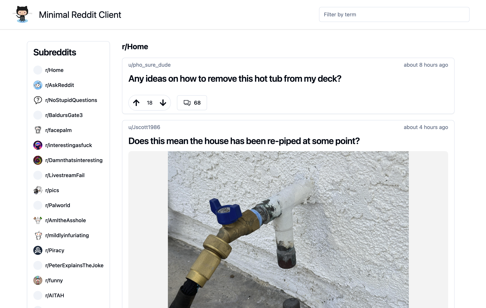

# Reddit Client

### Description

This is my solution to the Portfolio Project: Reddit Client for Full-Stack Engineer Path at Codecademy. I cheated on many parts and this is a simplified version compared to the project requirements.

### Features

- Shows reddits by subreddit.
- Show comments and replies.
- Vote up or down a reddit.
- Select subreddit from list.
- Filter page by searchterm.

### Technologies

- **[React](https://reactjs.org/):** A JavaScript library for building fast and interactive user interfaces.
- **[Tailwind CSS](https://tailwindcss.com/):** CSS Framework.
- **[Semantic HTML](https://developer.mozilla.org/en-US/docs/Glossary/Semantics):** HTML markup to reinforce the meaning of information in webpages.
- **[Redux](https://redux.js.org/):** State management system.

### Links

- GitHub URL: [https://github.com/norrland90/reddit-client-portfolio-project]
- Live URL: [https://redditclientnorrland90.netlify.app/]

### Contact

Created by [@norrland90](https://github.com/norrland90) - feel free to contact me!
